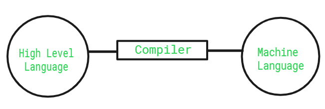
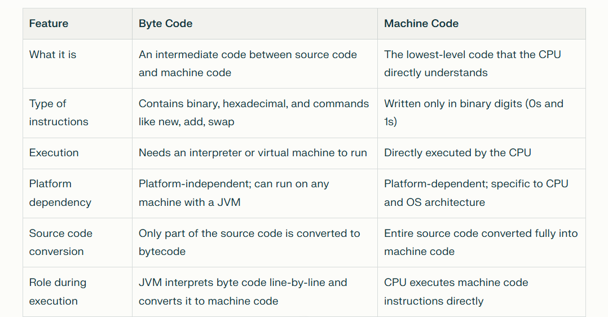

Q.why javascript is called the interpreted language?

      JavaScript is an interpreted language. To understand this better, let's look at interpreters, compilers, and JIT (Just-In-Time) compilers:

      1. Interpreter: interpreter is a type of translation software that directly executes programming source code line-by-line at runtime, rather than       converting   the entire program into an executable file beforehand
      2. Compiler: A compiler changes the entire program into object code (or binary code) and saves it. This code can then be run by the machine.
      3. JIT Compiler: A JIT compiler converts code into byte code first. Then, at runtime,
          it changes the byte code into machine-readable code, which makes the program run faster.

Q/How Code is Executed (The Compilation Phase) ?

      While many call JavaScript an interpreted language,
      modern engines use Just-In-Time (JIT) Compilation to make it incredibly fast. 
      When you feed code to the engine, it goes through three major steps:

      1.Parsing: The engine reads your code and parses it into a tree data structure called an Abstract Syntax Tree (AST).

      2.Compilation: The engine takes that tree and translates it into intermediate Bytecode.

      3.Execution & Optimization: The engine starts running the bytecode while simultaneously monitoring it. 
        If a piece of code runs frequently, the JIT compiler compiles it directly into Machine Code 
        on the fly so it executes at lightning speed.

Q.why console.dir() used in the javascript?

      Ans.The console.dir() method is used in JavaScript to display an interactive, hierarchical list
      of all the properties and methods of a specified object 

Q.why we write document.getElementById("Idname") ?

      Ans.In JavaScript, we write document.getElementById("idname") to find and select a specific
      HTML element on a webpage so that we can interact with it or change it
      dynamically.

      document : This represents the entire webpage. It is the root object that contains all the
      HTML elements on your page
      .getElementById : This is a built-in JavaScript method (a function) that tells the
      browser to look through the document for an element with a matching ID.
      ("idname") : This is the argument you pass to the function. It tells the browser the
      exact name of the ID you are searching for. IDs are case-sensitive and must be
      unique on a single webpage.